DAQ Software for IV, CV, TCT measurements of Silicon Diodes: Description and How to Use
===

This software is used to perform IV, CV, and TCT measurement of CMS HGCAL Silicon test structures. 


[TOC]

## References

[**Particulars**](http://particulars.si/) website for technical informations about the setup. 

## Definitions

TCT = Transient Current Technique

IR = Infra-Red laser

DUT = Device Under Test

DAQ = Data Acquisition software

# Installation

## Prerequisites


Install `uv`:

**Windows:**
```powershell
powershell -c "irm https://astral.sh/uv/install.ps1 | iex"
```

**macOS/Linux/Git Bash:**
```bash
curl -LsSf https://astral.sh/uv/install.sh | sh
```

## Clone repo

```
git clonehttps://<username>@github.com/aimaax/daq-iv-cv-tct-silicon-diodes.git
cd penguin
```

## Run measurement with software

1. uv run start_GUI.py
2. Choose root directory for the measurement. In the picture below, the root dir is chosen to be low fluence campaign. Then fill in the sensor ID with the amount of fluence and the laser density with its corresponding annealing time [valid units: min, h, days]. Then press **Apply** to get consistent filenames across IV, CV, and TCT measurements. 

<div align="center">
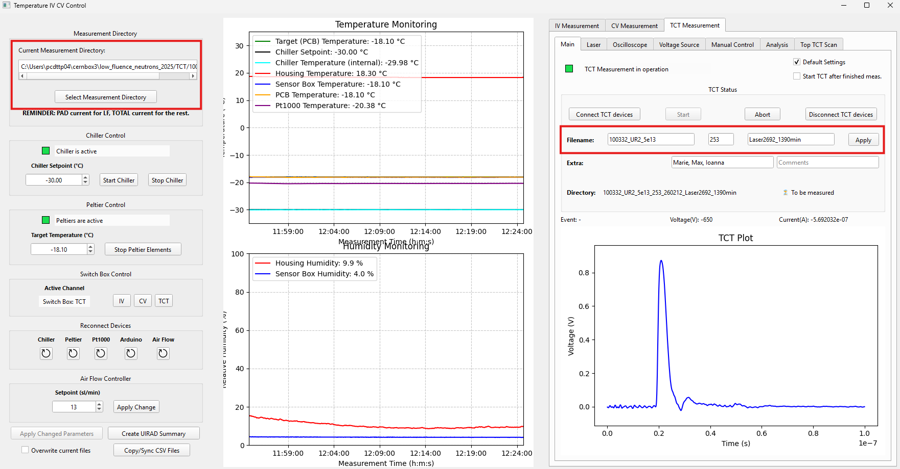
</div>

3. Press Connect TCT devices, located above the sensor ID input under TCT Measurement --> Main to connect voltage source, oscilloscope and laser for the TCT measurement. The laser will turn on automatically so be careful to turn it off if you want to open the Faraday's cage to change the sample. 
4. To check if the right cable of the PCB has connection, a voltage bias of -6V is applied under Manual Control to get expected current of 1e-5 to 1e-8 depending on the radiation level. Unirradiated samples are expected to have a leakage current of around 1e-9 at -6V. When that is checked, and the humidty of the Sensor Box Humidity is below 10%, the chiller and peltier can be started by pressing **Start Chiller** and **Start Peltier Elements**. 
5. When the temperature of the PCB and the PT1000 is below -15 degrees, a -500V bias can be applied to align the laser to the opening. To manually run the oscilloscope, press On in the same row as *Toggle Oschilloscope*, (important that the laser is on, otherwise no signal would be seen), and then move the x and y axis by pressing the arrows until a signal is seen. 
6. To start the measurements (when the temperature of PCB is -18.1C) then press Start IV Measurements. To automatically run CV and TCT afterwards, the checkboxes **Start CV/TCT after finished measurement**. The data will be automatically stored under root_folder(chosen step 3)/IV|CV|TCT. A timer can be activated with X time. If the timer is activated and a 5min time delay has been set, then after pressing e.g. Start IV Measurement, it will take 5min before the measurement starts.
7. After the TCT measurement is finished, it will be analysed under the Analysis tab by taking the integral of the signal (integration window defined in config.py). 

<div align="center">
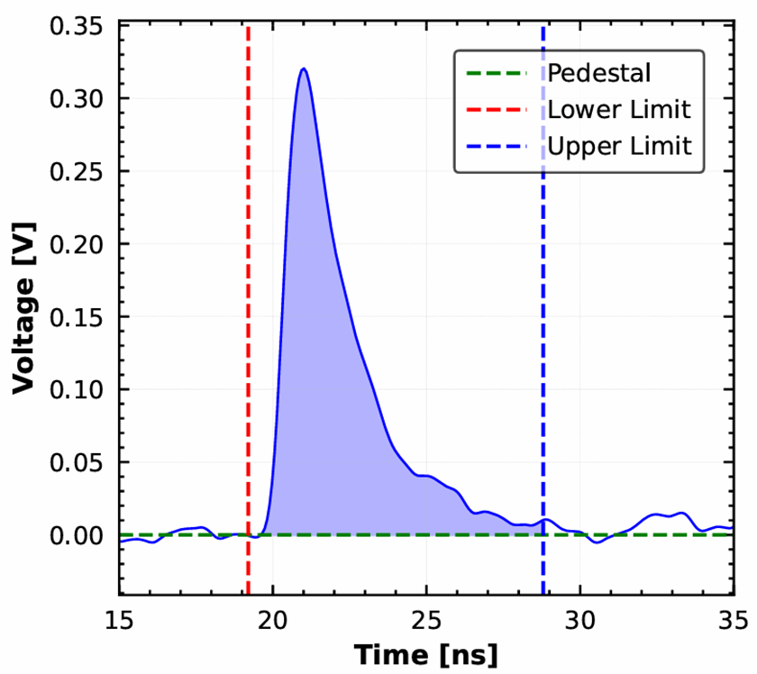
</div>

8. All values are then printed in .csv file in the same analysis directory where the Charge Collection is the CCE and CCE2 values. 

<div align="center">
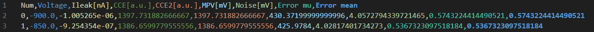
</div>

9. At the end of the day, measure 300um unirradiated diode as a laser reference. Name 300um_UIRAD with only laser intensity e.g. Laser2648 will automatically choose the unirradiated directory and change the voltage steps from -700 to -400 with 100 V steps. Then Create UIRAD Summary will display the average value which is used as a correction factor by calculating: 3200/mean_CC_unirrad
10. Sync all new data to [PENGUIN](https://github.com/aimaax/PENGUIN.git) repo by pressing Copy/Sync CSV Files or press Exit, and Copy/sync all csv files to [PENGUIN](https://github.com/aimaax/PENGUIN.git) Git repo. 


# Description and Devices


 **Cooling System** 
 
- Chiller (Huber C505), pumping ethanol through the chuck
- PID temperature controller (LairdTech PR-59)
- 4 Peltier elements below the mounting plate
- Power supply for the Peltiers (TSX3510P Programmable DC PSU)
- Flow of dry air to reduce humidity

**Positioning system** 

- x,y (chuck) and z (laser) stage 
- Computer controlled (XiLab)
- 5 cm x 5 cm x 5cm moving range
- Position resolution 1um

**Laser and Optics**

- 1064 nm wavelength
- Single core fiber connected
- Single pulse: 50 Hz - 1MHz frequency
- Software controlled, intensity tunable (few MIP - 100 MIP equivalent): Software [**here**](https://gitlab.cern.ch/CLICdp/HGCAL/particulars_setup/-/tree/dev/DAQ/LaserDriver-V2.1) 
- Beam spot (FWHM): <11 microns@1064 nm
- Attenuation: through collimator on beam-expander 
- Reference photodiode to monitor laser intensity

**Electronics and Data Acquisition** 

- Amplifier: 53dB
- Bias-T: Particulars, Range >1000V, Frequency 0.3MHz - >3000MHz
- DUT biasing: 2 Keithley 2410 power supplies
- IV measurements: Picoameter
- CV measurements: LCR meter, Decoupling box
- Oscilloscope: Tektronix MSO54
- Peltier power supply: TSX3510P DC
- Laser and amplifier powered by Particulars power supply
- Switchbox
- Switchbox power supply
- Multimeter (Keithley 2001) for PT1000 readout


<div align="center">
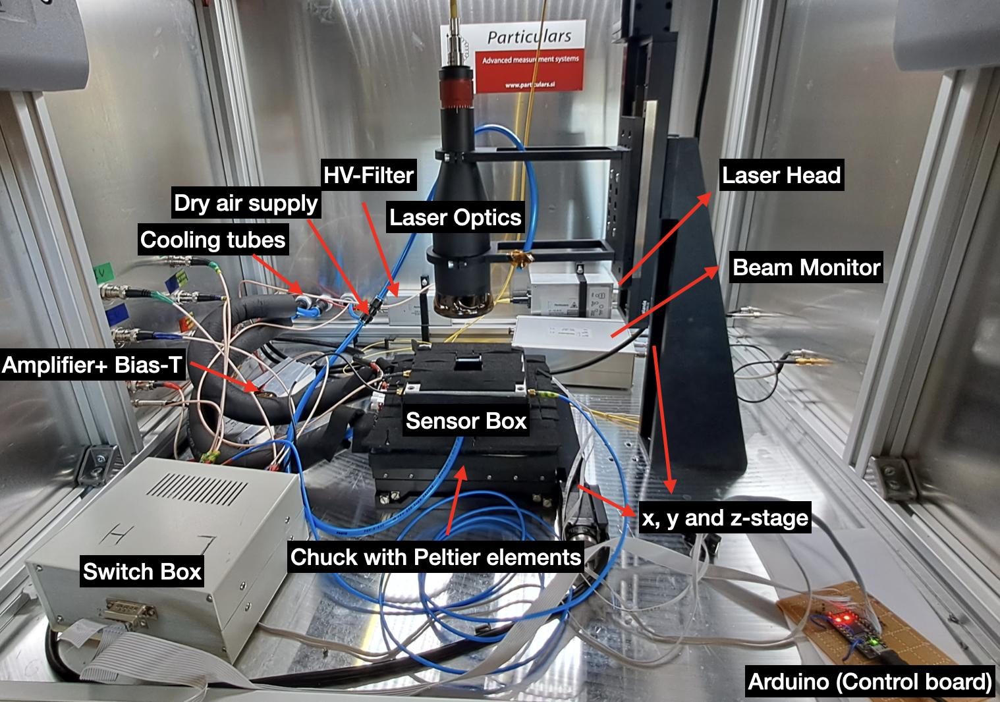
</div>


<div align="center">
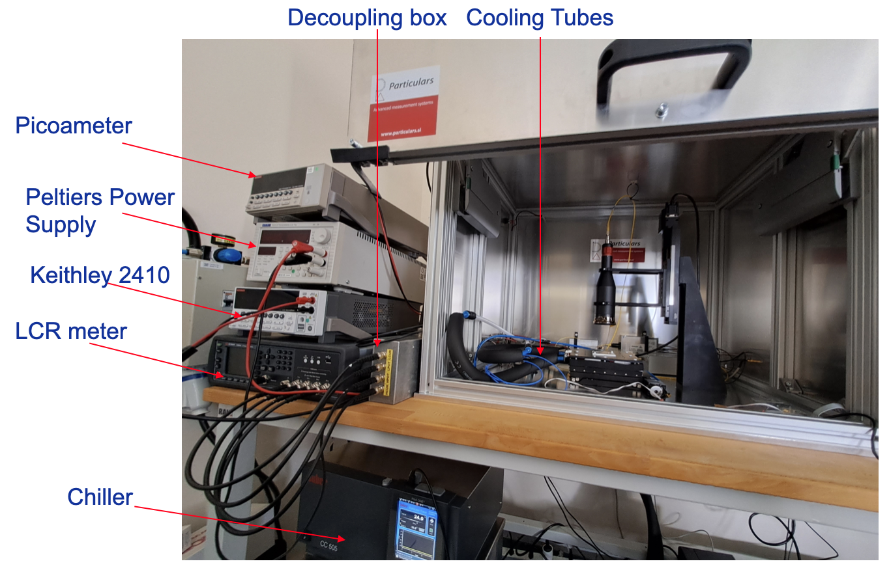
</div>


# Sensor Placement and Cabling


 ## Placement

The sensors are placed on small PCBs with the sensor top connected to the readout channel, the guard ring grounded and the backside of the sensor connected to a second connector. This PCB is placed on a copper mounting plate insider a sensor box, which acts as a Faraday cage. Dry air is directly supplied to the sensor box to reduce the humidity. To monitor the temperature, a sensor is permanently fixed to a piece of PCB glued onto the copper plate. Additionally, there is a humidity sensor placed inside the box to monitor the humidity. For newer boards, there is a PT1000 glued onto the PCBs alongside the DUTs, which can be connected through the upper left SMA connector. 

The lid of the box has a cutout to allow the laser light to shine through from the top. The box can me minimally moved despite the screws, it should always be pushed as far as possible to the right bottom, to keep the sensors in the exact same position. This reduces the amount of time to search for the metal opening on the sensor surface. 


<div align="center">
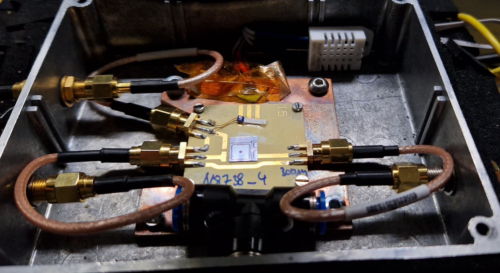
</div>


The SMA connectors of the PCB have to be connected to the cables inside the sensor box, which can be then closed afterwards. No further handling inside the sensor box is necessary and it can start to dry down. 


## Cabling

With the switch box present, the cabling does not need to be changed anymore to switch between measurement types. To read about the cabling without a switch box, the old version of the Readme is still available within this GIT repository. 
The connections through the switchbox to all devices is described in the following part. 

From the sensor box, the right SMA connector (sensor backside) is connected to the middle of the switch labeled H (high voltage), the left SMA connector (sensor pad, signal line) is connected to the middle connector of the switch labeled L (low voltage). 

For each switch, the additional connectors 1, 2 and 3 are connected inside the box. Line 1 is the TCT circuit (running by default), 2 is the CV circuit and 3 the IV circuit. The IV and CV circuits will be switched to in the measurement software, after a measurement the switches go back to the default state (TCT, channel 1). The different circuits are color coded, as shown in the picture below. 
Red for TCT, blue for C and green for IV/CV. The addition of a green-yellow tape represents the HV part of the circuits. 


<div align="center">
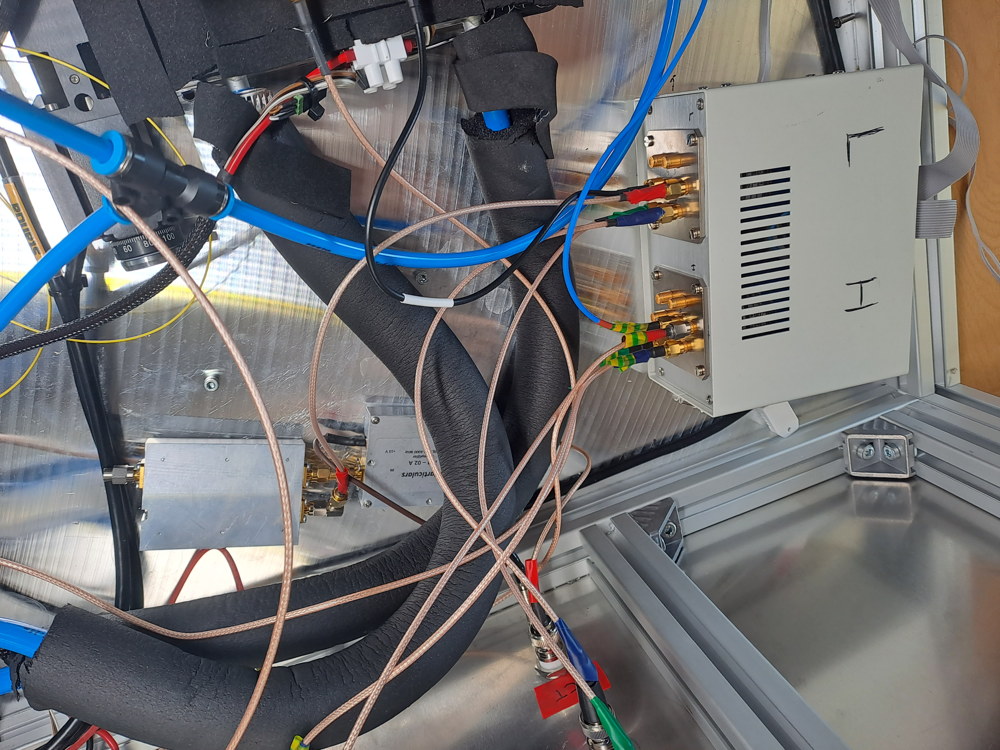
</div>


The High Voltage Switch routes the lines for the HV supply towards the sensor. For each measurement type, a different line is followed. 
Connector 1 for the TCT is routed through a HV filter, which is further connected through the setup wall to a Keithley 2410 (GPIB 07). Connector 2 is directly routed through the setup box to the decoupling box. The connections of the decoupling box are described further below. 
Connector 3 is routed through the box wall directly as well, Outside of the box the Keithley is connected with a cable that splits between the Picoameter and the HV connector of the setup box, as shown in the picture below.
For CV measurement the front of the second Keithley 2410 (GPIB XX) is used, for the IV measurements the rear output is connected. 


<div align="center">
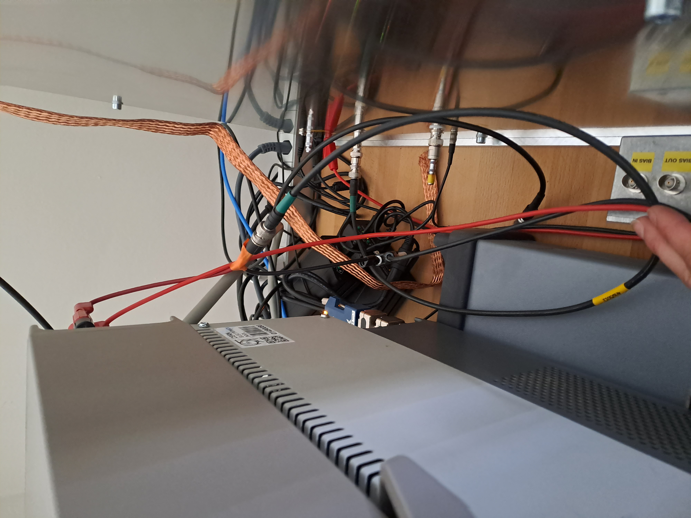
</div>


The Low Voltage Switch is routing the signal output lines to the correct measurement device. For the TCT, line 1 is connected with the Bias-T & amplifier combination, which is the further connected through the setup wall to the oscilloscope. Line 2 for the CV is again put directly through the wall towards the decoupling box. Line 3 for the IV is routed through the box, but terminated with 50 Ohm there, as no further measurement device is necessary. 


For the CV measurements, the decoupling box has to be connected. 
The LCR meter is connected to the decoupling box as shown in the picture below and as labelled at the connectors. 


<div align="center">
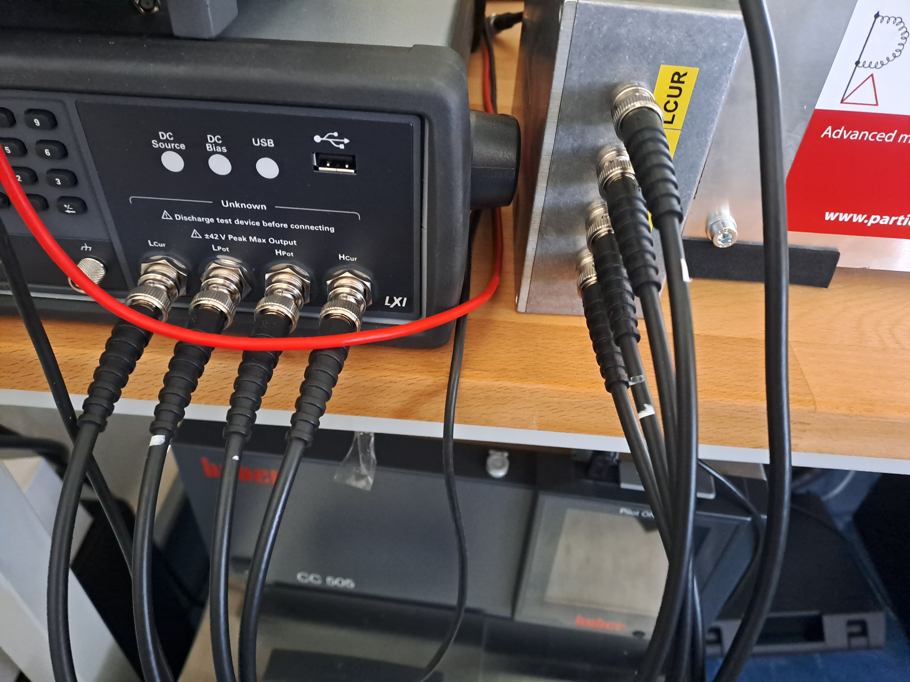
</div>


On the side of the decoupling box, there are several other outputs. The Keithley 2410 is connected to the connector labelled "Bias in", while the connector "Bias out" is not used and just terminated with 50 Ohm. The connector HDUT is then connected to the corresponding HV connector of the setup box, while the LDUT connector is connected to the signal output connector. 


<div align="center">
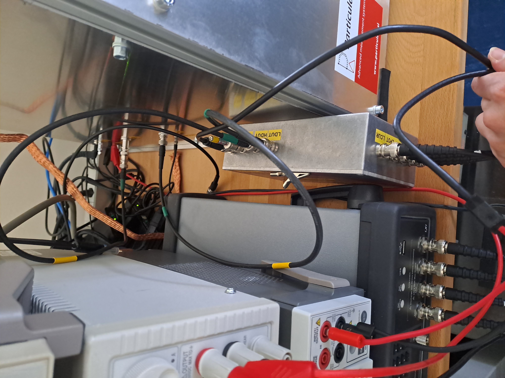
</div>


The cabling for the beam monitor and the laser always remains the same and thus shouldn't have to be adapted, it is shown in the picture above. 
The laser fibre is going into the beam monitor, where it is split and one part of the beam goes to the photodiode, while the second part of the beam is connected to the the laser optic system with a second fiber. The output of the beam monitor is cabled to the according connector and further continued to the oscilloscope without any additional amplification. 
The laser driver powers the laser head as well as the amplifier, it is positioned outside the setup box. The power cables are labelled and remain always connected. The laser has a trigger output, which is also connected through a labelled connector in the setup box to the oscilloscope. 


<div align="center">
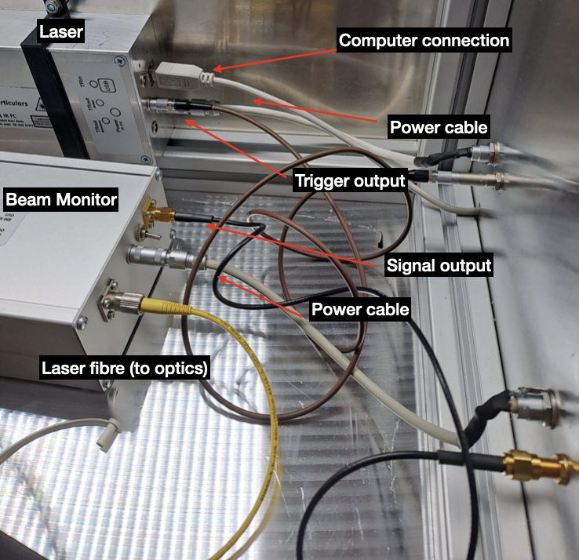
</div>


## IV measurement configurations: pad and total current

IV can be run in two configurations: 

1. Measuring the total current, including both pad and guard ring.


<div align="center">
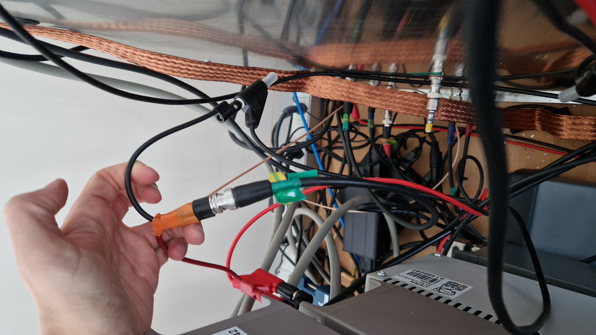
</div>

2. Measuring only the pad current, not including the current from the guard ring. This area is more well defined for the calculation of the leakage current damage rate. 

<div align="center">
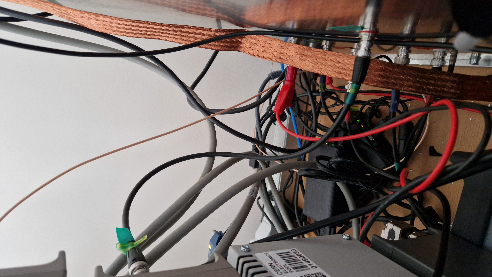
</div>

# DAQ Software and Temperature Control

 ## Temperature Control

As soon as the Chiller is turned on, the temperature control can be done entirely via software now. 
The software can activate the chiller to pump the ethanol through the chuck and cool it down to a set temperature, usually -30°C.
The Peltier elements above the chuck are powered by a voltage supply, which is controlled by a Python software to adapt the supplied voltage to keep the temperature steady. 
Before starting to cool down, the setup needs to be dried down to prevent ice inside it, so the dry air needs to be turned on. Two humidity sensors track the relative humidity, one inside the sensor box and one inside the general setup enclosure. They are displayed and logged automatically once the software is running, as shown in the picture below.

<div align="center">
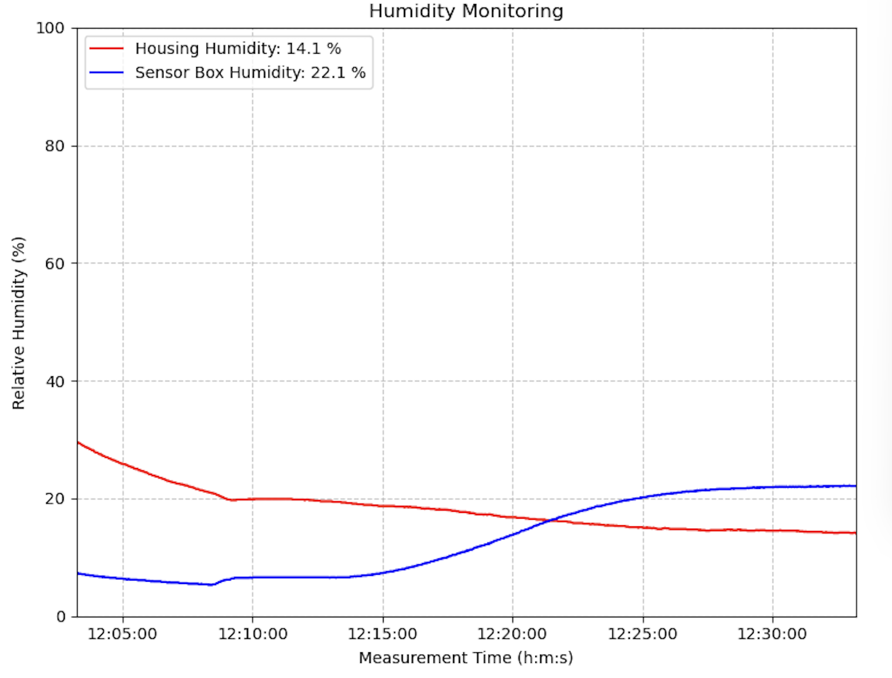
</div>

There are several temperature sensors inside the setup. The sensor used to drive the power supplied to the Peltiers is fixed inside the sensor box. It is glued to a piece of PCB, which in return is glued to the copper plate where the DUT PCB is positioned. Additionally, in most cases there is a PT1000 glued to the PCB of the DUT, to record the temperature as close to the DUT as possible. The humidity sensors also record the temperature, so that the general temperature in the enclosure box and inside the sensor box are recorded as well as the temperature of the cooling liquid. 
The software displays all temperatures recorded along with the set temperatures, as shown in the Figure below. 

 
<div align="center">
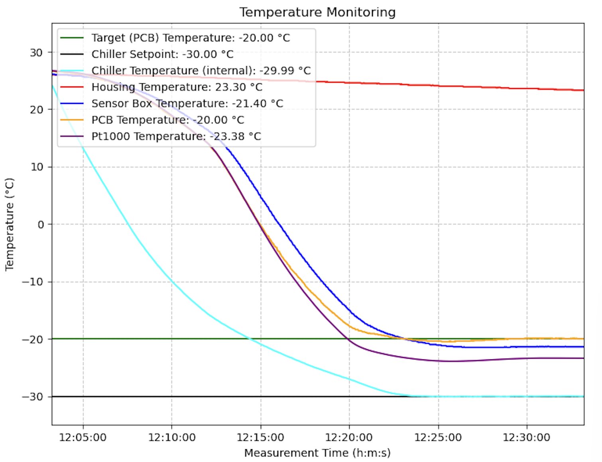
</div>


The temperature control is run within one main GUI, where also IV, CV, and TCT measurements can be run. 


## Annealing and Radiation Hardness Studies

To analyse all data of the low/high/double irradiation/proton campaigns, an Python-based GUI analysis tool has been created for this [PENGUIN](https://github.com/aimaax/PENGUIN.git).


## Code Architecture

Please read [ARCHITECTURE.md](ARCHITECTURE.md) for more information.


